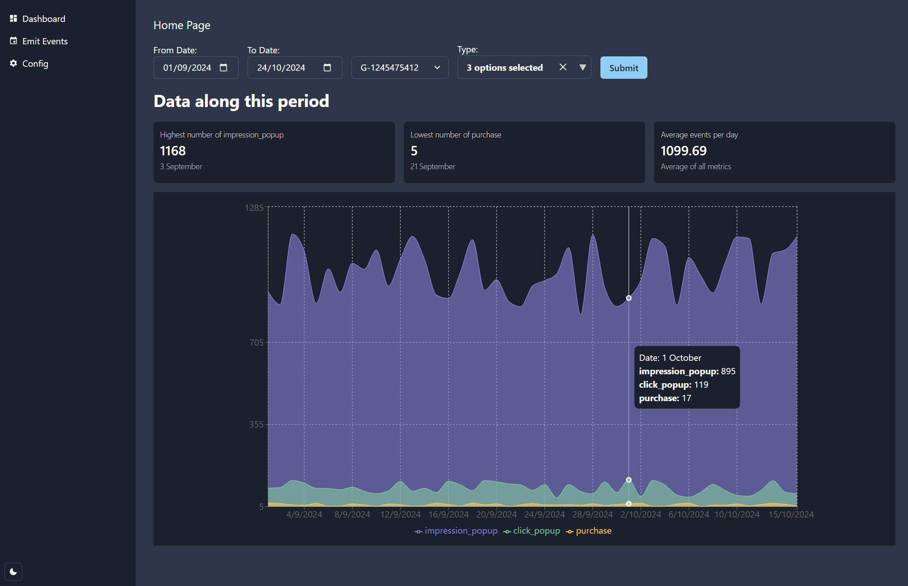
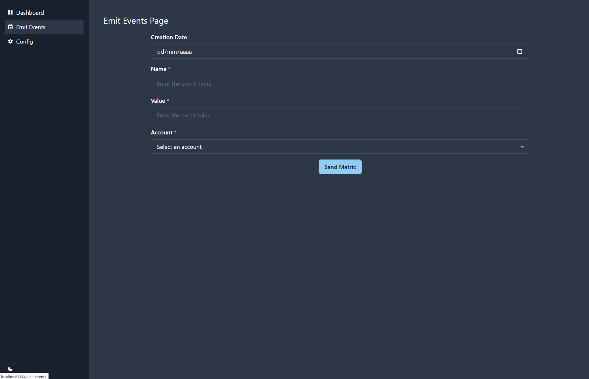
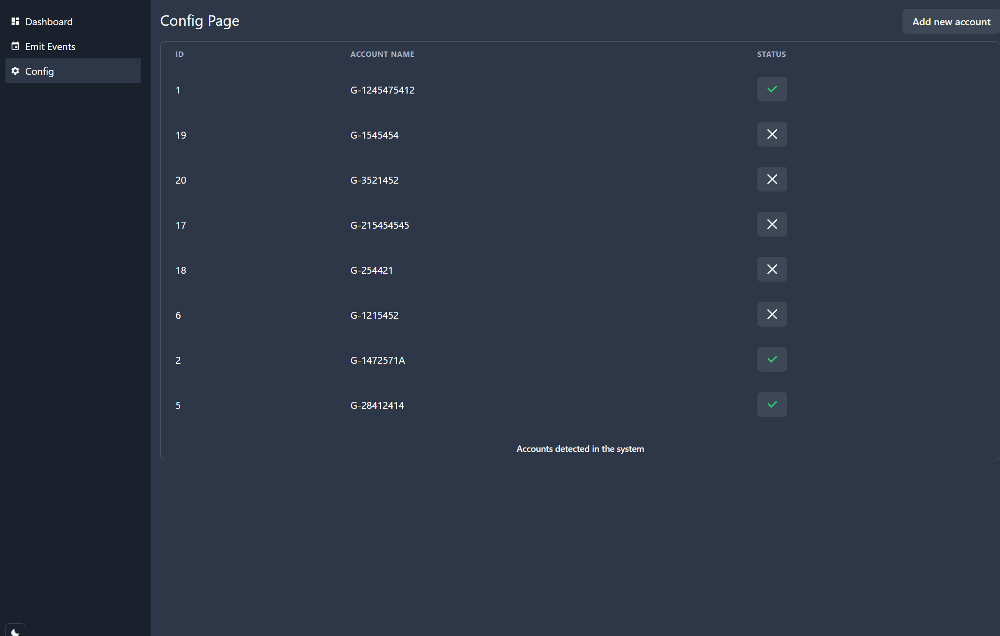

# Facto Analytics

This project is a simple analytics dashboard to visualize metrics data. Made with Next.js, Chakra UI, Recharts, Cypress and Supabase.

## How to run the project

1. Clone the repository
2. Run `npm install` to install the dependencies
3. Run `npm run dev` to start the project

## How to run the tests

1. Run `npm run cypress:open` to open the Cypress Test Runner

## What does the project do?

The project allows you to visualize the metrics data in a dashboard. You can filter by date, account and name of the event. You can also see the funnel and pie charts. Besides, you can add new metrics to the database from the emit events page. Finally, you can configure accounts in the configuration page.

## Screenshots

## Project deployed

https://facto-analytics.vercel.app

## Problems found

### Data structure

- I have assumed in the basic data structure (created_at, name, value), value corresponds to the number of events accumulated of one day.
- I've added a new field called `props` to store the properties of the event. But I didn't use it for anything because I didn't know what to do with it. The main problem is how treat this accumulated data between the different devices, countries, etc (props is used to identify the device, country, etc).
- I've decided to add the `account` field to identify the account that is sending the events (like GA4 works)

### General

- Started working with ReactJS but I decided to use Next.js + Supabase, because I needed a backend to store the metrics data.
- This is my first time working with Chakra UI, but I really liked it. The theming system is really good. I decided to use Chakra UI because I like discover new components libraries.
- I decided to use Chart.js but I had some problems with the graphs (not being displayed), so I changed to use Recharts instead. This was my first time working with Recharts but the documentation is really good.
- I had some problems with the colors in the charts, so I decided change the default colors for the charts.
- I was doing the project without refactoring the code, I did the minimum to make it work (MVP). After that, I decided to refactor the code to improve the code quality and readibility.

### Future improvements

- Add more tests.
- Responsive design.
